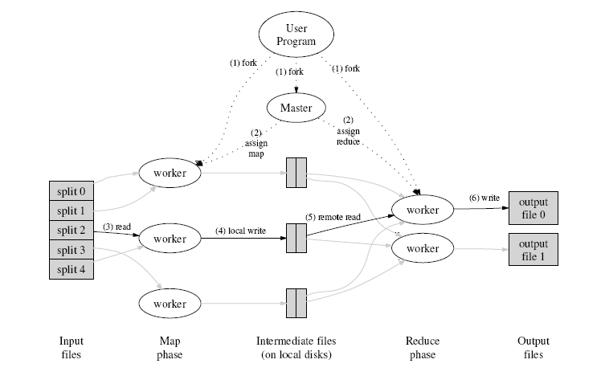

Shavadoop
=========

A implementation of MapReduce in Java. 
A simple wordcount program.  
   
1. Context and goals  
2. Program architecture  
3. How the program is working   
&nbsp;&nbsp;&nbsp;&nbsp; - The master  
&nbsp;&nbsp;&nbsp;&nbsp; - Workers   
&nbsp;&nbsp;&nbsp;&nbsp; - The MapReduce   
4. Program usage  
&nbsp;&nbsp;&nbsp;&nbsp; - Prerequisites   
&nbsp;&nbsp;&nbsp;&nbsp; - Usage  

## Context and goals
The goal of Shavadoop is to implement in Java a "word count" in MapReduce, Hadoop style. For record, the "word count" is a program aiming to count the occurrences number of each word of a file, and the MapReduce implementation do these operations into distributed computing for a clsuter of machines.  
MapReduce is made up of two main functions : the one called Mapping and the other called Reducing. Here the Reducing function is splitted into two other functions called Sorting and Shuffling.
  
The MapReduce is running into a simple network architecture : a Master and several Slaves (Workers). Master role is to manage, oversee and launch programm remotly. Workers role is to run task launched by the Master and notified it in case of issues.  
  
Communication between master and workers is done with SSH protocol. It's very useful and convenient as we have to launch command remotly. 

## Program architecture  
Code is organized around six packages:    
- Utils : Contains all the useful features of the project, such as reading or writing to a file. This package also contains Configuration class which is used to set features of MapReduce process.  
- Ssh : Contains all functions link to networks and SSH protocol (remote comamnds, network verification...).  
- Master : Contains all features link to the Master (dictionaries, split, merge...).  
- Slave : Contains all features link to workers (map,reduce, sort, shuffle...).
- MapReduce : Contains the main process for mapreduce.  
- Test : Contains the main function to test the "word count".  

## How the program is working
### The Master
In addition to having the three dictionaries, the master also obtains three methods that can perform useful operations for the proper functioning of the overall program :  
Splitting : this method split the file by line. Essential for the "word count".  
CleanFolder : this method remove all files of a directory, specialy the one where workers are computing.  
MultipleMerge : this method do a UNIX 'cat' on multiple files into one. Very useful to gather informations. Moreover the UNIX 'cat' function is highly powerful and quick.  
### Workers
Each stage of MapReduce has a main class whose name matches that step, and a second class ending with an 'x'. These are patterns class intended to be modified by the main classes and copied to the workers.  
Main classes are: Mapping UnikWords, Shuffling and Reducing.  
Associated patterns (respectively): UMX, Uwx, SHX and Rex.  
Note: UnikWords to sort words and a list of single words.  
In general the main classes will write the source files (from patterns) directly on the workers, compiled and executed. This transaction is returned
via threads, each thread is invoked for a particular machine. For example,
Mapping will create a thread to the machine with the IP 192.168.1.100 and generate, from the UMX pattern, the UM0 own class with class attributes to the thread. Then the thread compiles and run this class on the worker.  
The main classes have all three methods that are similar:
- AddEcho: allowing the addition of the "echo" to start the bash command remotely and to generate the source file (.java).  
- CreateExevJava: for modifying the "pattern" classes.   
- execEtape: compiles and run the source file on the worker.  
All steps (exepted Split and Merge) and gathered into a super class named Slave. 
### The MapReduce
MapReduce class gather Master and Slave classes and run steps into the right order from a text file. Threads of each differents steps are invoqued via loops and a join is done after the loop, simulating a wait order for threads before follow the algorithm.  
Otherwise a network discovering of machines is done at the begining of the MapReduce process and store into a list. This research is unique, the network is not checked after.   

## Program usage    
### Prerequisites
Program requires only one external library : Jsch which implement the SSH protocol is Java. The .jar file is available [here](http://www.jcraft.com/jsch/).  
Another information : SSH connections are done with through a key, so it's necessary to configure the whole network before run the MapReduce.  
### Usage
The code is very simple to use. You must import sources into a new project eclipse and import the jar jsch. Then open the Configuration class (the utils package) that allows configuring the program settings.  
Parameters description:  
- SlavePath : this is the folder where all the source files and compiled will be. Being given that the school network has a file system sharing a single file is enough.  
- Sshkey : is the path to the SSH key.  
- Sshuser : is the user name on the network.  
- SshSubnet : is the subnet which achieves the MapReduce (ip address without the last number).  
- SshNumberOfHosts : is the number of machines for performing the MapReduce.  
- Debug : is the debug mode. If it is active, each connection or operation is displayed in the console.  
Once the setup is complete, go to the Test Package inot the test class and replace the path of the text file with the one you want mapreducer. Start the main and enjoyed !  

   